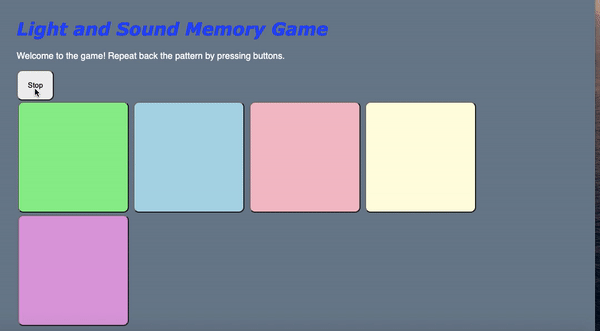

# Pre-work - _Memory Game_

**Memory Game** is a Light & Sound Memory game to apply for CodePath's SITE Program.

Submitted by: Rishab Jain

Time spent: 2 hours spent in total

Link to project: https://glitch.com/edit/#!/aspiring-bronzed-track

## Required Functionality

The following **required** functionality is complete:

- [DONE] Game interface has a heading (h1 tag), a line of body text (p tag), and four buttons that match the demo app
- [DONE] "Start" button toggles between "Start" and "Stop" when clicked.
- [DONE] Game buttons each light up and play a sound when clicked.
- [DONE] Computer plays back sequence of clues including sound and visual cue for each button
- [DONE] Play progresses to the next turn (the user gets the next step in the pattern) after a correct guess.
- [DONE] User wins the game after guessing a complete pattern
- [DONE] User loses the game after an incorrect guess

The following **optional** features are implemented:

- [DONE, added hover effect to button] Any HTML page elements (including game buttons) has been styled differently than in the tutorial
- [DONE, changed around the frequency] Buttons use a pitch (frequency) other than the ones in the tutorial
- [DONE, added a 5th button] More than 4 functional game buttons
- [ ] Playback speeds up on each turn
- [DONE, added a differentPattern function to the script] Computer picks a different pattern each time the game is played
- [ ] Player only loses after 3 mistakes (instead of on the first mistake)
- [ ] Game button appearance change goes beyond color (e.g. add an image)
- [ ] Game button sound is more complex than a single tone (e.g. an audio file, a chord, a sequence of multiple tones)
- [ ] User has a limited amount of time to enter their guess on each turn

The following **additional** features are implemented:

- [ ] List anything else that you can get done to improve the app!

## Video Walkthrough

Here's a walkthrough of implemented user stories:

## Reflection Questions

1. If you used any outside resources to help complete your submission (websites, books, people, etc) list them here.

[I used the mdn web documentation to understand the Math libarary of javascript to create a different pattern at the start of each game]

2. What was a challenge you encountered in creating this submission (be specific)? How did you overcome it? (recommended 200 - 400 words)

[I didn't experience many challenges in creating this submission. I had to troubleshoot the button lighting up when the computer was playing back a pattern. It turned out that in my css file instead of having #button1.lit, I had mistakenly put #button1:lit. The way I overcame this problem was by inspecting one of the buttons and seeing what changes were being made to the html. After inspecting the button, it became clear that the lit class was being added through the script so the problem could only lie in the css file. After carefully looking at the css file, I found the mistake in which I should have used a class selector. Basically, this was one of those nitpicky bugs in code which are hard to find because you have been staring at the code for quite some time. In my experience, the best way to overcome these is to find a very methodical approach to test and find exactly where the problem exists. Using the inspecting functionality of chrome allowed me to see what was happening to the JavaScript, html, and CSS to pinpoint the problem. Overall, the instructions were very straight forward to understand and I had previous experience with a web app like this which helped.]

3. What questions about web development do you have after completing your submission? (recommended 100 - 300 words)

[I took a Udemy course which taught me the overarching components of a full stack web application so most of this was pretty familiar. However, the main question I have about web development is how to create a project that is valuable to the user and helps solve a problem. What I mean by this is that a real web application requires other dimensions like security that I would like to learn. In my opinion, learning how to code becomes significantly easier when working toward a practical goal or project. By learning by doing, the results are more tangible and there is an internal passion that can overcome any challenge. In essence, I believe I have the basic understanding to implement a web application but I would like to work on a project with a group of committed coders (at the same level) all learning together and achieving something amazing. By working to a clear target and being able to feel the impact of my work, I will be motivated to no ends to develop the product. In short, I would like to be in a program that allows a group of students to come up with an idea/project and then provide them a tailored curriculum to implement that idea.]

4. If you had a few more hours to work on this project, what would you spend them doing (for example: refactoring certain functions, adding additional features, etc). Be specific. (recommended 100 - 300 words)

[If I had a few more hours to work on this project I would add a couple of features. I would allow the user to choose between playing a computer and another human. If the user chooses a computer the current code would be sufficient to support this, but if the user choose a human one of the players would choose the sequence. Also, for both versions of the game I would add a score that persists through multiple games so the user can play to the best of 5 possibly. Furthermore, I would create functionality for an infinitely long game. In other words, if the user keeps getting the pattern correct the computer will just continue to add more to the pattern. In this way, the computer can never lose. Lastly, I have worked with Alexa skill games so if I had the time I would try to combine the current logic into a voice-controlled game which I think would be pretty cool.]

## License

    Copyright [Rishab Jain]

    Licensed under the Apache License, Version 2.0 (the "License");
    you may not use this file except in compliance with the License.
    You may obtain a copy of the License at

        http://www.apache.org/licenses/LICENSE-2.0

    Unless required by applicable law or agreed to in writing, software
    distributed under the License is distributed on an "AS IS" BASIS,
    WITHOUT WARRANTIES OR CONDITIONS OF ANY KIND, either express or implied.
    See the License for the specific language governing permissions and
    limitations under the License.
